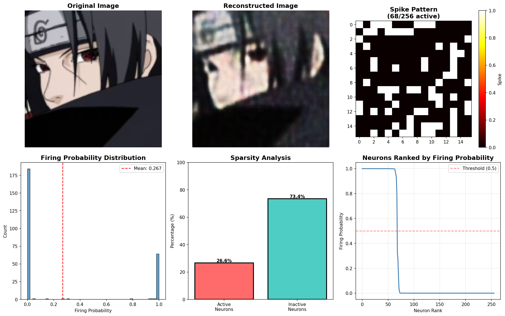

# Spiking-SVAE
Download and intercept facial images of 593 anime characters as training data for spike-SAE. Treat the latent variable z as a Bernoulli distribution, pulse encode the image into a Bernoulli variable and then decode it, and decode it according to the firing pulse time of the last layer of spiking neurons. The size of the image pixel value is taken, and the 128-dimensional hidden layer feature is taken, and the image is normalized to 128*128 size as input. Due to the coefficient characteristics of pulse coding, an L1 norm is naturally added after the loss, and the variational loss in VAE is changed to Bernoulli variational loss.

**Figure:** **A.**  Validation set reconstruction results after training for 5 epochs

**Figure:** **B.**  Validation set reconstruction results when training for 95 epochs

**Figure:** **C.**  Reasoning using a random picture

**Figure:** **D.**  Details of pulse release in reasoning process
